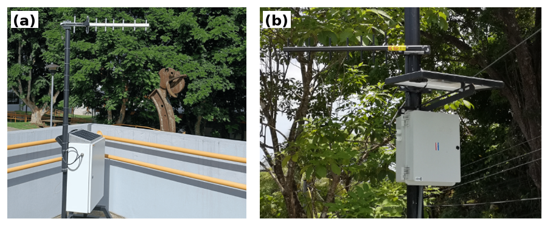

# Digitalization of Community-Managed Rural Aqueducts in Costa Rica

**Authors:** María José Angulo Campos; Carlos Montoya Marín; Juan José Montero-Jiménez; Juan José Rojas-Hernández  
**Affiliation:** Tecnológico de Costa Rica, Cartago, Costa Rica

**Abstract—** This article synthesizes the development trajectory of digital monitoring solutions for Costa Rican ASADAS and derives transferable architectural criteria without prescribing a fixed platform. The analysis uses a comparative case synthesis of Las Juntas de Abangares, Playa Sámara, and Paso Ancho--Boquerón, considering the operational problem, measured variables, interfaces, energy, communication, digital services, evidence, and limitations. The findings are organized according to the MBSE distinction between needs, logical functions, and physical implementation. The synthesis identifies a stable functional core---remote observability, interoperability with existing assets, fewer required site visits, energy autonomy, decision support, and maintainability---that can be implemented through a modular chain of measurement, acquisition, communication, storage, visualization, and alerting. The prototypes provide partial and incremental technical evidence, and the current Paso Ancho design is an instantiation still under development. This article reports no new field validation or measured effects on losses, continuity, workload, or costs; such effects require sustained operation.

**Keywords—** digital water, rural water infrastructure, Internet of Things, ASADA, remote monitoring, operational support, Model-Based Systems Engineering, modular architecture, digital modernization

## 1. Introduction

Digital transformation in water infrastructure integrates sensing, communications, data management, and automation as parts of an operational system rather than as isolated technologies [1]--[3]. This integration is especially important in rural aqueducts, where assets are dispersed and access to personnel, maintenance, energy, and connectivity may be limited. In Costa Rica, more than 2000 community water organizations, or ASADAS, operate these systems [4], and previous studies have documented constraints in infrastructure, maintenance, and technical capacity [5], [6].

Digitalizing a rural aqueduct is therefore not equivalent to installing sensors or publishing measurements. The solution must adapt to limited energy, intermittent connectivity, existing instrumentation, manual routines, and information needs for supply planning. The engineering challenge is to convert dispersed measurements into reliable, accessible, and useful operational information.

This article synthesizes three prototyping experiences in Costa Rican ASADAS. Las Juntas de Abangares moved from discrete manual measurement to autonomous level acquisition, cellular communication, storage, and visualization [7]. Playa Sámara expanded the scope to distributed monitoring, LoRa links, IoT services, alarms, and control-oriented design [8]. Paso Ancho--Boquerón explored industrial interfaces, Modbus, 4--20 mA sensing, remote telemetry, and replicability [9]. Part of this learning was later formalized as a modular architecture through MBSE [10].

The scope is delimited with respect to the ISSE 2025 paper, which focuses on a generic and modular architecture for IoT systems in rural aqueducts using ARCADIA/MBSE [10]. This manuscript reconstructs the preceding technical trajectory, includes Las Juntas de Abangares, and compares prototype evidence, generalized capabilities, and current design decisions. It does not present a new validation or reproduce the methodological development reported in the ISSE work.

The contributions are: (1) to integrate three ASADA digitalization developments; (2) to identify recurring operational needs and architectural implications; (3) to distinguish tested functions, MBSE-formalized capabilities, and current Paso Ancho elements that remain subject to deployment; and (4) to propose cautious criteria for transferability and evaluation.

## 2. Method

We used a comparative case synthesis to integrate heterogeneous prototype evidence without turning it into a statistical evaluation. The cases were selected because they form a documented sequence from Laboratorio Delta/TEC with Costa Rican ASADAS, span increasing levels of complexity---tank level, distributed monitoring with existing meters, and industrial interfaces---and have available technical sources. They are not an exhaustive national sample.

The primary sources were the technical reports and final graduation projects for Las Juntas de Abangares, Playa Sámara, and Paso Ancho--Boquerón [7]--[9]. For the current Paso Ancho instantiation, public design artifacts from commit b791b87---including firmware, requirements, bill of materials, the functional-version document, and the IVV plan---were reviewed from the repository under development [11]. These artifacts are treated as evidence of design and planned integration, not as evidence of end-to-end deployment; the commit is a design snapshot, not proof of field operation. Any future performance claim should be accompanied by ICDs, firmware/configuration, raw data, and test protocols. ISSE 2025 was used only to delimit the published MBSE architecture [10].

The extraction considered the operational problem, hydraulic variables, sensors and interfaces, controller, energy, communication, digital service, test evidence, and limitations. A need was recorded when the same purpose appeared in more than one development or when a later case made a latent constraint explicit. Each need was then reinterpreted using the MBSE logic that separates needs, capabilities, functions, and physical implementation.

To control the inferences, each statement was classified as a function implemented in a prototype, bench/laboratory test, limited field test, reported sustained operation, or designed/future element; Table 2 summarizes this classification. LoRa is used for the long-range physical link; LoRaWAN is retained only when citing the original wording, without inferring a complete network when the evidence documents LoRa links with a gateway. No new measurements, prolonged trials, or statistical analyses of water losses were conducted: the results are a technical synthesis and design criteria, not a full operational validation.

## 3. Recurring Digitalization Needs

Across the analyzed experiences, the technologies changed, but recurring operational needs emerged from user requirements, site constraints, sensor tests, energy estimates, and communication and visualization decisions. Table 1 summarizes their relationship with architectural decisions.

### 3.1 From Manual Measurements to Remote Observability

The first need was to turn intermittent records into remote observability. In Las Juntas de Abangares, tank level was measured approximately every fifteen days with a scale and recorded in a notebook, which prevented observation of daily or seasonal variations and modeling of demand and supply [7]. The prototype tested automatic measurements every hour or every 20 minutes, including date and time stamps, plots, and data download; although it did not provide evidence of sustained operation, it showed the value of improving continuity, traceability, and availability.

Sámara and Paso Ancho--Boquerón extended observability to flow, volume, level, communication status, and operating conditions [8], [9]. An isolated variable is therefore insufficient: the information must reconstruct the hydraulic and operational state with adequate frequency and reliability.

### 3.2 Interoperability with Existing Infrastructure

ASADAS do not begin with homogeneous infrastructure or with assets designed for digitalization. Sámara preserved ARAD Octave meters and developed interfaces for flow and volume [8]; Paso Ancho--Boquerón reinforced this approach through 4--20 mA signals and Modbus [9]. The architecture must accept simple sensors, existing meters, analog signals, pulses, or industrial buses according to the site.

### 3.3 Remote Operation, Energy, and Communications

Field constraints were constant. Las Juntas combined SIM7600, HTTP, solar power, battery, regulator, and 2G/3G/4G coverage tests in response to the absence of electricity and WiFi [7]. Sámara used LoRa, a gateway, and solar power [8]; subsequent designs consider direct LTE and monitored power. Although the technology may change, the stable function is a verifiable path from the measurement to the end user.

### 3.4 Operational Support and Maintainability

Visualization was only the first step. Las Juntas prioritized queries, plots, and downloads [7]; Sámara documented alarms and pumping logic [8]; the ISSE 2025 architecture proposes event detection, notifications, supply--demand analysis, data exchange, backup, and system health as functions to be verified [10]. Digitalization matures when data support operation and maintenance rather than only measurement screens.

**Table 1. Recurring needs and architectural implications.** {#tab:needs}

| Need | Evidence across the developments | Architectural implication |
|---|---|---|
| Remote observability | From a biweekly notebook to automatic measurements; later flow, volume, level, and operating status. | Persistent, traceable, and remotely accessible data. |
| Interoperability | Ultrasonic sensors, Octave meters, 4--20 mA signals, Modbus, RS-485, and communication options according to the site. | Adaptable field interfaces that complement useful assets. |
| Remote operation | Absence of electricity or Internet, variable coverage, and the need to reduce in-person visits. | Energy and communication as configurable and verifiable modules. |
| Operational support | From plots and download to alarms, pumping logic, events, notifications, and analysis. | Support decisions and maintenance; control only where verified. |
| Reliability and maintainability | Calibration, validation, backup, system health, controlled access, and data transfer, not yet supported by sustained evidence. | Traceability, verification, security, recoverability, and documented performance. |

## 4. Prototyping Experiences

The initial experiences helped identify real constraints, necessary functions, and reusable criteria. Table 2 summarizes the state of evidence and the limits used to interpret each case.

### 4.1 Las Juntas de Abangares: From Manual Measurement to an Autonomous Prototype

Las Juntas de Abangares began with the need for tank-level data for CIEDES water-balance, demand, and supply-capacity studies. Manual records did not allow daily changes to be observed or consumption models to be built [7]. The case formalized activities that recur at other sites: needs, constraints, sampling frequency, sensor selection and calibration, communication, storage, visualization, and energy autonomy.

The prototype used a waterproof AJ-SR04 ultrasonic sensor calibrated by linear regression, an Arduino Nano, a real-time clock, a SIM7600 modem, HTTP transmission to a database, a web interface for queries, plots, and data download, and solar power with a regulator and battery [7]. It is interpreted as a prototype with functional and calibration tests, rather than as evidence of sustained operation. Its contribution was to demonstrate the minimum chain measurement → acquisition → communication → storage → visualization, and to show that cellular coverage, sampling frequency, calibration, and panel location affect replicability.

### 4.2 Playa Sámara: Distributed Monitoring and Control-Oriented Logic

Sámara addressed the need for remote hydraulic visibility and manually adjusted pumping schedules. Three IoT ASADAS V1.0 devices with Heltec LoRa 32 V2 interacted with Octave meters and combined local acquisition, LoRa links, solar power, a gateway, MQTT, and Adafruit IO. Although the original report uses LoRaWAN, it is interpreted here conservatively as LoRa links with a gateway and application packets, without assuming a complete LoRaWAN network. In limited tests against meter displays, the interface reported a 0% difference in accumulated volume and 0.73% in average flow [8]; these values are not interpreted as absolute system accuracy. Alarm logic and pumping electrical design were also developed, but the power modernization was not completely deployed.

This stage expanded the learning toward integration with existing meters, distributed nodes, longer-distance communication, and decision-oriented information. It also showed that progress toward control requires separating monitoring, decision, and actuation.

### 4.3 Paso Ancho--Boquerón: Industrial Compatibility and Replicability

Paso Ancho--Boquerón focused on remote monitoring of level, flow, and volume with industrial interfaces. An M-Duino 21+LoRa acquired level from a submersible sensor through 4--20 mA and flow/volume from Octave meters through Modbus; LoRa links communicated with a WiFi gateway to ThingSpeak [9]. The architecture included autonomous energy and a replicable node. The evidence must be read with caution: no sustained end-to-end operation is reported, and some final visualizations used representative or assumed hydraulic values.

Its contribution was to introduce industrial signals and reinforce the configurable field node. Together with Las Juntas and Sámara, it helped distinguish stable functions---acquisition, communication, storage, visualization, and operational support---from implementations that vary according to the site.

**Table 2. Cases used in the synthesis and state of evidence.** {#tab:cases}

| Case | State of evidence | Supported functions | Limit considered in the synthesis |
|---|---|---|---|
| Las Juntas de Abangares | Implemented prototype; functional tests, calibration, and visualization. | Level, cellular HTTP, web database, query/download, and solar power. | No sustained operation or long-term performance. |
| Playa Sámara | Devices, LoRa, and IoT dashboard tested through bench and limited field tests; pumping control designed, not deployed. | Octave through SSR pulses, LoRa nodes with gateway, MQTT/Adafruit IO, and alarms. | 0% and 0.73% are differences from displays; not absolute accuracy or a complete LoRaWAN network. |
| Paso Ancho--Boquerón 2024 | Prototype with partial field/laboratory tests. | 4--20 mA level, Modbus, M-Duino, LoRa, WiFi gateway, and ThingSpeak. | No sustained end-to-end operation; plots with representative or assumed values. |
| Current Paso Ancho | Design under development; public design artifacts at commit b791b87 in mission-definition review. | Firmware b791b87: RS-485, Octave Modbus flow/volume, 0--5 m analog level, and serial port. | SIM7600 commented out; no evidence of LTE, cloud, or end-to-end operation. Reconcile the 24 V One-Wire sensor with the analog input before fixing the interface. |
| ISSE 2025 | Published MBSE architecture. | ARCADIA/MBSE generalization. | Only delimits and contextualizes; it is not replicated or validated. |

Figure 1 shows representative hardware from two documented cases and is included as visual support for the comparison.

**Fig. 1. Representative hardware documented for (a) Paso Ancho--Boquerón and (b) Playa Sámara [8], [9].** {#fig:hardware}

## 5. Formalization through MBSE

The experiences show local decisions, but they also reveal a recurring functional structure: measurement → acquisition → communication → digital service → information for the operator. Sensors, controllers, links, platforms, energy arrangements, and the degree of operational support may change.

Here, MBSE is used as a conceptual framework for synthesis, not as a technological imposition. ARCADIA refers to the systems-engineering and model-based architecture method documented by Voirin [12]. The formal development of the generic architecture with ARCADIA belongs to the ISSE 2025 work [10]; therefore, this article does not introduce a new MBSE model or report an executed verification, but reuses the separation between operational needs, logical functions, and physical implementations.

That separation makes it possible to move from HTTP to MQTT, from LoRa to LTE, from an ultrasonic sensor to 4--20 mA, or from an external platform to a managed platform without losing the system logic.

## 6. Resulting Modular Architecture

The resulting modular architecture is a configurable foundation, not a fixed list of components. For each site, data acquisition, local validation, energy, communication, ingestion, storage, visualization, notification, backup, system health, and verification must be resolved and verified.

### 6.1 Field Node

The field node interacts with the hydraulic infrastructure: it may measure level with an ultrasonic sensor, read a 4--20 mA sensor, acquire Octave registers through Modbus, or incorporate other sensors. Its stable function is to transform physical variables into time-stamped data, apply basic validations, and prepare communication. Calibration, environmental protection, consumption, and maintainability must be designed from the outset.

### 6.2 Energy and Communication

Energy and communication depend on the site: Las Juntas used solar and cellular; Sámara used LoRa and a gateway; and Paso Ancho--Boquerón used LoRa, WiFi, and an industrial structure. These elements must therefore be treated as replaceable modules with verifiable requirements for frequency, availability, autonomy, recovery, consumption, and environmental protection.

### 6.3 Digital Services and Operation

The digital layer must store data, make them accessible, and convert them into operational information. Web visualization, IoT services, cloud services, dashboards, notifications, backups, and access control are instances of general functions: persistence, query, visualization, alerting, analysis, and maintenance.

## 7. Current Application in Paso Ancho

The current Paso Ancho design is an instantiation of the modular architecture oriented toward deployment and remains under development [11]; it is not presented as an already deployed platform. The public design documentation at commit b791b87 places the project in mission-definition review and lists, as design requirements, mobile monitoring, alerts for overflow and insufficient supply, acquisition from an Octave meter and a level sensor, operation without fixed power or Internet, environmental protection, maintainability, availability, and cybersecurity.

In the public firmware b791b87, an ESP32 node initializes RS-485, reads flow and volume from the Octave meter through Modbus, reads an analog height input, scales it to 0--5 m, and emits results through a serial port. The SIM7600 wrapper is commented out, so the code does not provide evidence of LTE transmission, remote upload, or a validated end-to-end chain. In addition, the final sensor interface must be reconciled: the project documentation describes a 24 V One-Wire depth sensor, whereas the firmware implements an analog input. This article does not claim a validated final interface; the physical, electrical, and data interface must be documented and verified in the version that is deployed.

The remaining b791b87 artifacts are treated as design and future-testing documentation, not as evidence of implemented and validated capabilities for LTE, a remote platform, cybersecurity, availability, backups, node health, notifications, or end-to-end verification. Future remote communication choices should therefore be treated as implementation decisions made to satisfy the stable requirement of transferring data from a site without fixed Internet.

## 8. Discussion: Lessons Learned and Transferability

The three cases do not represent a linear replacement of one technology by another, but rather a progressive reduction of design uncertainty. Las Juntas de Abangares made it possible to test a minimum chain of measurement, communication, storage, and visualization. The Playa Sámara experience incorporated existing meters, distributed nodes, LoRa links, and control-oriented functions. Paso Ancho--Boquerón then introduced industrial interfaces and a node with greater replicability potential. This sequence suggests that digitalization of an ASADA can advance incrementally, beginning with information availability and adding capabilities as site constraints become clearer.

One important lesson is the value of incremental modernization. Preserving Octave meters and other functional assets can reduce infrastructure replacement, initial costs, and operational disruption. However, this strategy also shifts complexity toward acquisition interfaces, protocol interpretation, calibration, and fault diagnosis. Interoperability should therefore be understood not only as the possibility of connecting devices, but also as the ability to preserve data meaning, quality, and traceability along the entire chain.

The comparison also shows that no universal option exists for energy and communication. LoRa, cellular communication, WiFi, and different solar-power configurations respond to specific conditions of coverage, distance, electrical availability, consumption, and maintenance. Technology selection should follow verifiable requirements for measurement frequency, autonomy, availability, fault recovery, and environmental protection. Modularity offers an advantage only when interfaces and verification criteria are defined with sufficient precision.

From this perspective, MBSE functions as a framework for relating operational needs, system functions, and physical implementations. In this article, it is used as a tool for synthesis and transfer, not as a new validation of the architecture presented at ISSE 2025. Its utility lies in allowing an ASADA to select a combination of sensors, controllers, communications, and digital services without losing the common functional structure identified in the analyzed cases.

The scope of the analysis corresponds to three experiences developed in Costa Rican ASADAS and does not aim to represent all community water organizations in the country. The comparison is qualitative and is based on final graduation projects, technical reports, and project documentation that used different testing conditions and criteria. The reported precision, communication, energy, and operational results are therefore not directly comparable. In addition, there is still no evidence of prolonged operation that would allow availability, energy autonomy, maintenance, operator acceptance, or effects on water losses and service continuity to be quantified. These aspects should be evaluated through future field deployments with common metrics.

## 9. Future Work: Operational Evaluation

Future work will focus on completing integration of the current architecture and evaluating it under representative operating conditions. The first stage will verify the acquisition, communication, storage, visualization, notification, and node-status monitoring chain. A sustained deployment will then observe system behavior under variations in connectivity, energy, sensors, and environmental conditions.

The evaluation should quantify data availability, recovery from communication failures, energy autonomy, measurement plausibility, alert behavior, maintenance interventions, and operator acceptance. These results will make it possible to determine which functions and modules can be transferred directly to other ASADAS and which require adaptation. Advanced functions, such as water-loss analysis and supervisory control, should be evaluated only after the reliability of the basic monitoring infrastructure has been demonstrated.

## 10. Conclusion

This work synthesized three digitalization experiences developed for Costa Rican ASADAS: Las Juntas de Abangares, Playa Sámara, and Paso Ancho--Boquerón. The comparative analysis indicates that, although the technologies differed, needs related to remote observability, interoperability with existing infrastructure, communication from isolated sites, energy autonomy, and operational support recurred across the cases.

The main contribution of the synthesis is to distinguish functions that can be reused from components that must be adapted to each aqueduct. In this framework, MBSE is used as a conceptual tool to relate operational needs, system functions, and physical implementations, complementing the architecture work published at ISSE 2025. The available evidence supports the initial feasibility of the prototypes, but it does not yet support claims of sustained performance, reduced water losses, improved service continuity, or generalized transferability. Such claims require prolonged field tests that evaluate availability, energy autonomy, communication, alerts, maintenance, and security.

## Statement on the Use of Artificial Intelligence

The authors declare that OpenAI Codex based on GPT-5.5 was used to support the review of wording, technical coherence, bibliographic traceability, and LaTeX formatting. It was not used to generate, synthesize, or manipulate data, results, or figures; responsibility and final approval belong to the authors.

## References

[1] M. Arnell, M. Miltell, and G. Olsson, "Making Waves: A Vision for Digital Water Utilities," *Water Research X*, vol. 19, p. 100170, 2023, doi: 10.1016/j.wroa.2023.100170.

[2] C. Z. Zulkifli *et al.*, "IoT-Based Water Monitoring Systems: A Systematic Review," *Water*, vol. 14, no. 22, p. 3621, 2022, doi: 10.3390/w14223621.

[3] N. K. Velayudhan, P. Pradeep, S. N. Rao, A. R. Devidas, and M. V. Ramesh, "IoT-Enabled Water Distribution Systems—A Comparative Technological Review," *IEEE Access*, vol. 10, pp. 101042--101070, 2022, doi: 10.1109/ACCESS.2022.3208142.

[4] Dirección de Agua de Costa Rica, "ASADAS," 2025. [Online]. Available: <https://da.go.cr/asadas/>

[5] S. M. Soto-Córdoba, L. Gaviria-Montoya, and M. Pino-Gómez, "Situación de la gestión del agua potable en las zonas rurales de la provincia de Cartago, Costa Rica," [in Spanish], *Revista Tecnología en Marcha*, vol. 29, no. 8, pp. 67--76, 2016, doi: 10.18845/tm.v29i8.2986.

[6] L. Gaviria-Montoya, M. Pino-Gómez, and S. M. Soto-Córdoba, "Risk Associated with the Water Infrastructure in Rural Water Suppliers in Turrialba, Cartago, Costa Rica," *Sustainable Water Resources Management*, vol. 6, art. no. 56, 2020, doi: 10.1007/s40899-020-00410-x.

[7] Y. J. Chavarría Castro, "Implementación de un sistema prototipo para el monitoreo de la variación de nivel de líquido, en una ASADA ubicada en la comunidad de las Juntas de Abangares," [in Spanish], Final graduation project, Escuela de Ingeniería Electrónica, Instituto Tecnológico de Costa Rica, Costa Rica, 2021. [Online]. Available: <https://hdl.handle.net/2238/15115>

[8] S. Solórzano Alfaro, "Sistema de control y monitoreo hídrico, basado en LoRaWAN, para el acueducto principal de la Asociación Administradora del Acueducto Rural de Playa Sámara de Nicoya," [in Spanish], Specialization practice report, Escuela de Ingeniería Electromecánica, Instituto Tecnológico de Costa Rica, Costa Rica, 2021. [Online]. Available: <https://hdl.handle.net/2238/13234>

[9] A. Oviedo Muñoz, "Desarrollo de un prototipo para recopilación y monitoreo remoto de datos hídricos de los tanques, basado en dispositivos IoT, en la ASADA Paso Ancho y Boquerón," [in Spanish], Specialization practice report, Escuela de Ingeniería Electromecánica, Instituto Tecnológico de Costa Rica, Cartago, Costa Rica, 2024. [Online]. Available: <https://github.com/DeltaLabo/ASADA_Paso_Ancho/blob/b791b87/TFG_Alejandra.pdf>

[10] A. J. Arguedas-Rodríguez, M. J. Angulo-Campos, J. J. Montero-Jiménez, and J. J. Rojas-Hernández, "Towards a Modular IoT System Architecture for Rural Aqueducts Using Model-Based Systems Engineering," in *2025 IEEE International Symposium on Systems Engineering (ISSE)*, 2025, doi: 10.1109/ISSE65546.2025.11369985.

[11] DeltaLabo, "ASADA_Paso_Ancho: documentation and code for the design under development," GitHub, 2026, commit b791b87. [Online]. Available: <https://github.com/DeltaLabo/ASADA_Paso_Ancho/tree/b791b87>

[12] J.-L. Voirin, *Model-Based System and Architecture Engineering with the Arcadia Method*. ISTE Press--Elsevier, 2018, doi: 10.1016/C2016-0-00862-8.
